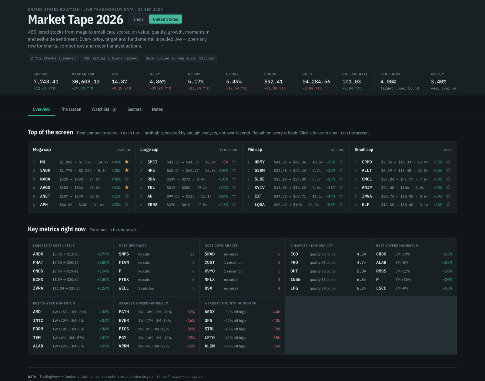
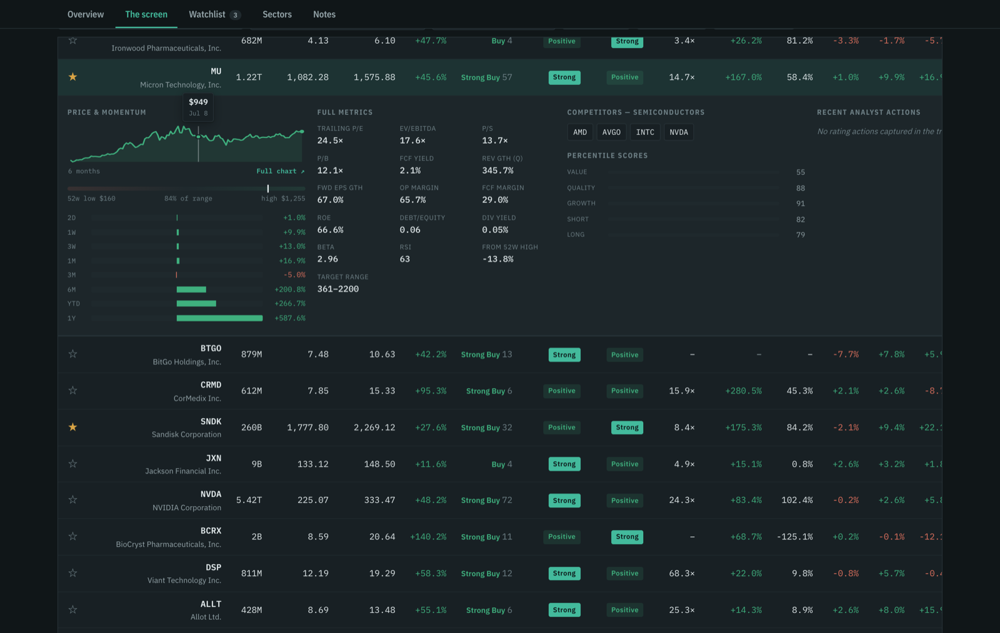
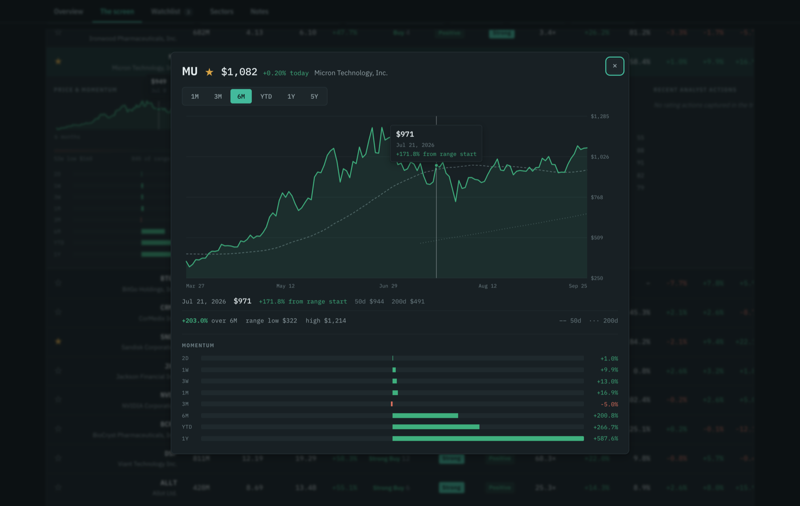
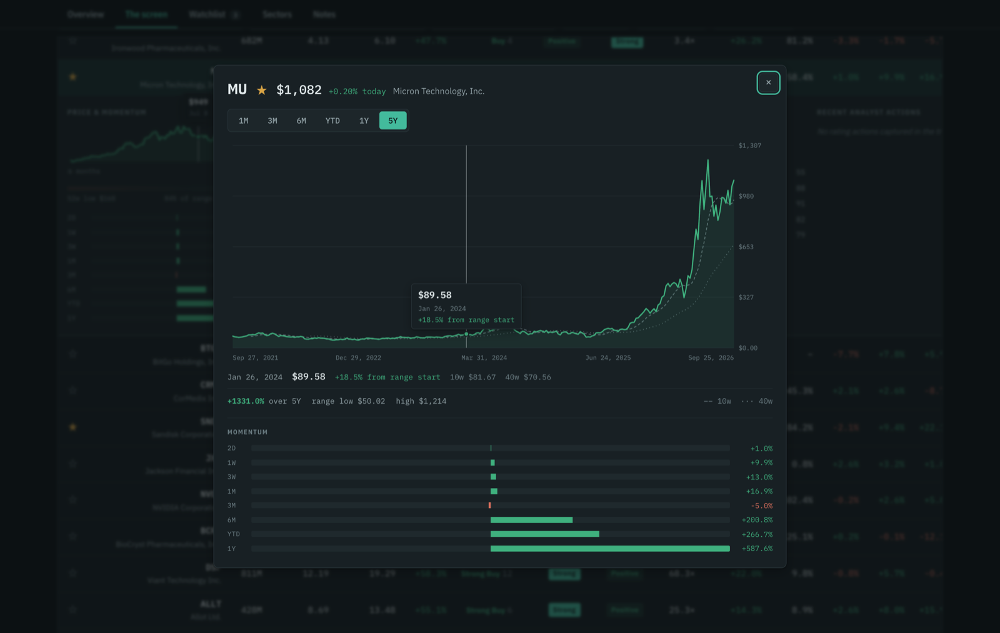
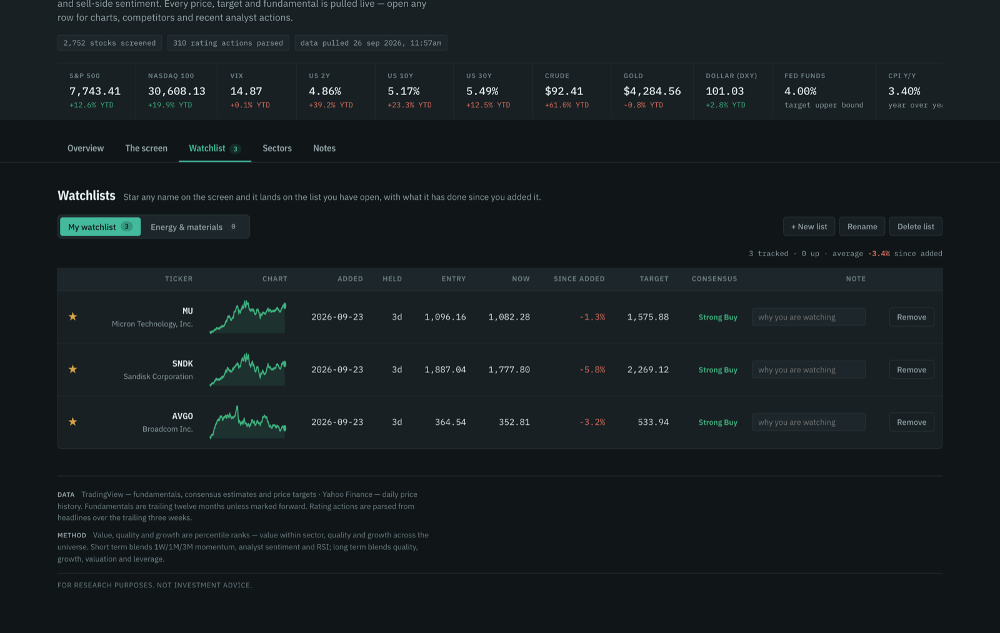
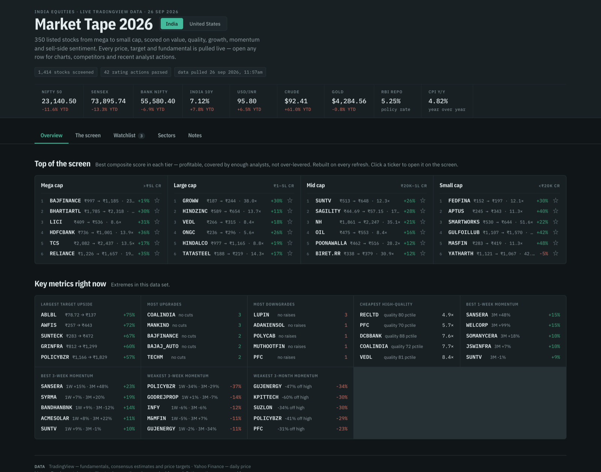
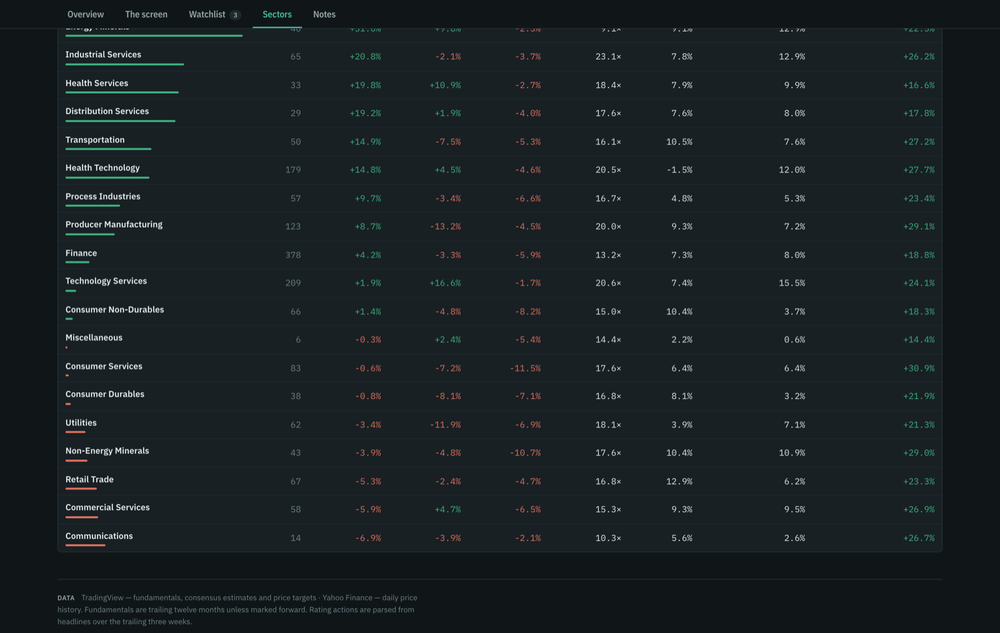

<h1 align="center">Market Tape</h1>

<p align="center">
  A live equity screener you run locally. Pulls ~2,700 US or ~1,400 Indian stocks,
  scores them on value, quality, growth and momentum, and renders one fast page
  with charts, competitors, analyst actions and a watchlist that persists.
</p>

<p align="center">
  
  
  
  
</p>

<p align="center">
  
</p>

```bash
git clone https://github.com/DIPJOY10/market-tape.git
cd market-tape
python3 refresh.py      # pull the data  (~40s)
python3 serve.py        # open it, watchlist saved to disk
```

The data pipeline is standard library only — no pip install, no API keys, no account.
Node is needed only if you want to change the interface.

---

## The screen

Every stock, sortable on any column, filterable by cap tier, sector, AI-linked,
profitable, or watchlist-only. Click a row and it opens in place: a six-month
sparkline, position within the 52-week range, momentum from two days to a year, the
full metric set, industry competitors and recent analyst upgrades and downgrades.



## Charts

Click any sparkline for the full chart. Six ranges, price and date axes, rolling
50- and 200-day means computed from the series itself, and a crosshair that reports
the close, the date and the change from the range start for any session.



Daily resolution out to one year, weekly across five. On the five-year view the
averages become 10- and 40-week, and the labels say so.



## Watchlists

Keep as many named lists as you like. Starring a name adds it to whichever list is
open, and entries record the price on the day you added them — so the tab shows what
each name has actually done since, not just that you were watching it.



Storage is picked at runtime:

| How you open it | Storage | Survives |
|---|---|---|
| `python3 serve.py` | SQLite in `watchlist.db` | browser changes, cleared site data, private windows |
| `build/<market>/local.html` from disk | `localStorage` | that browser only |

The page says so only in the second case, where the data genuinely can be lost.

## Two markets, one page

Switch between markets in the header and the whole page reprices — currency, market
cap units, cap-tier thresholds, the macro tape and the universe all follow the data.



| Code | Market | Currency | Universe | Chart symbols |
|---|---|---|---|---|
| `us` | United States | USD, T/B/M | NASDAQ, NYSE, AMEX | `NVDA` |
| `in` | India | INR, lakh crore | NSE | `RELIANCE.NS` |

```bash
python3 refresh.py --market in     # builds to build/in/
```

Each market builds and caches separately, and `serve.py` serves every market you have
pulled from a single port. The page also ships with its own market embedded, so it
works with no server at all — the switcher simply hides.

### Adding a market

Add an entry to `MARKETS` in `markets.py`. Nothing else should need editing:

| Field | What it drives |
|---|---|
| `scanner`, `market` | the TradingView scanner endpoint and query body |
| `currency`, `symbol`, `cap_units` | how prices and market caps are printed |
| `yahoo_suffix`, `yahoo_dot` | how a ticker is spelled for the chart endpoint |
| `floor`, `small_floor`, `min_volume` | the two screening sweeps |
| `tiers` | cap-tier thresholds *in local currency* and their labels |
| `macro` | the symbols on the tape, and which are headwinds |
| `ai` | the ticker set the "AI-linked only" filter matches |

Check three things first, since they are what usually break: that the scanner endpoint
returns rows for your market, that Yahoo resolves a sample ticker with your suffix, and
that the news endpoint returns headlines for an exchange-prefixed symbol. All three are
plain HTTP and take a minute with `curl`.

## Sectors

Median stock per sector across performance, valuation, returns and growth.



## How the scoring works

Value, quality and growth are **percentile ranks**, not absolute judgements. Value is
ranked *within sector* — a 15× bank and a 15× software company are not the same bet.
Quality and growth rank across the whole universe.

| Score | Built from |
|---|---|
| **Value** | forward P/E, EV/EBITDA, P/S, FCF yield — sector-relative |
| **Quality** | ROIC, operating margin, FCF margin, gross margin, leverage, current ratio |
| **Growth** | revenue growth TTM and latest quarter, forward EPS growth |
| **Short term** | 1W / 1M / 3M momentum, analyst sentiment, RSI position |
| **Long term** | quality, growth, valuation, leverage |

Momentum spans **2 days, 1 week, 3 weeks, 1 month, 3 months, 6 months, YTD and 1 year**.
TradingView publishes some of those; the 2-day and 3-week figures are computed from the
daily closes fetched for the charts, so they are exact rather than interpolated.

## Commands

```bash
python3 refresh.py                   # full pull -> build/us/
python3 refresh.py --market in       # India -> build/in/
python3 refresh.py --no-charts       # skip 5y price history: faster, smaller page
python3 serve.py --port 8811         # serve every built market + watchlist API
python3 digest.py [market]           # plain-text top picks and metric extremes
python3 fresh.py 4 [market]          # exit 0 if cached data is under 4 hours old
```

### Raycast

Raycast → Settings → **Extensions** → **+** → **Add Script Directory** → select `raycast/`.

| Command | Behaviour |
|---|---|
| **Market Tape** | Opens the screen. Re-pulls if data is over 4h old, starts the server |
| **Refresh Market Tape** | Forces a full re-pull, then opens |
| **Market Tape Top Picks** | Prints picks and metric extremes as text, no browser |

Set `MARKET_TAPE_MARKET=in` to point them at another market.

### Changing the interface

The React app lives in `web/`. `refresh.py` does **not** run Vite — it injects data into
the already-built `page.tmpl.html`, which is committed. So pulling data needs no Node at all.

```bash
cd web && npm install && npm run build    # vite build, then syncs ../page.tmpl.html
```

The build is one self-contained HTML file, which is what lets the page open straight
from disk.

## Data sources

| Source | Used for | Auth |
|---|---|---|
| `scanner.tradingview.com` | fundamentals, prices, targets, consensus ratings | none |
| `query1.finance.yahoo.com` | 5y daily price history for charts and short-horizon moves | none |
| `news-mediator.tradingview.com` | headlines, parsed for analyst rating actions | none |

These are public, undocumented endpoints. They can change or rate-limit without notice,
and this project is for personal and educational use — check each provider's terms before
doing anything else with it. Every network call degrades gracefully: a symbol that will
not resolve simply has no chart.

## Layout

```
markets.py            market profiles: currency, tiers, macro tape, ticker spelling
refresh.py            fetch -> score -> rate-scan -> inject -> build
serve.py              local server + SQLite watchlist API (stdlib only)
digest.py             plain-text summary of the last pull
fresh.py              freshness probe
page.tmpl.html        the built UI, committed so refreshing needs no Node
web/                  React + Vite source for that template
raycast/              three Raycast script commands
build/<market>/       generated; local.html is what you open
cache/<market>/       rows, tape, sectors, meta, accumulated daily closes
watchlist.db          your watchlists (gitignored)
```

## Known limits

- **Competitor sets come from TradingView's industry classification** and are sometimes
  wrong — insurers filed under "Technology Services", storage grouped with networking.
- **Trailing P/E can be flattered by one-off gains.** Check it against operating margin
  before believing a cheap headline multiple.
- **A low multiple on peak cyclical earnings is not value.** Memory, refining and shipping
  routinely screen at 5–13× forward at the top of their cycle.
- **Rating actions are parsed from headline text**, so they sample what the newswire
  surfaced rather than recording every analyst action.
- **Small-cap price targets often rest on 4–8 estimates** and swing on one revision.
- The **Notes** tab is hand-written commentary carrying a visible date stamp. It does not
  regenerate. Rewrite or delete it when the tape has moved.

## Not investment advice

This is a descriptive ranking of published numbers. "Screens undervalued" is a different
claim from "will go up", and stocks that screen cheap are usually cheap for reasons
informed people believe in. Nothing here is a recommendation to buy or sell anything.

## Licence

MIT — see [LICENSE](LICENSE).
